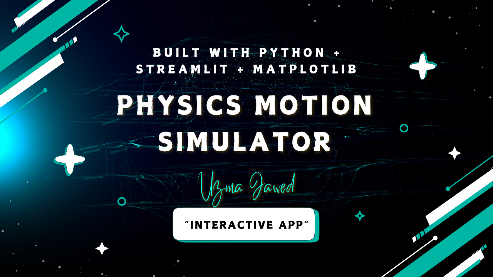

---



---

### ✨ Key Features

- 🔸 Simulate 1D and 2D (projectile) motion using kinematic equations
- 🔸 Compare two objects side-by-side
- 🔸 Watch real-time **1D motion animation**
- 🔸 Upload CSV to simulate multiple bodies at once
- 🔸 Clean, interactive **Streamlit web interface**
- 🔸 Includes history log for previous simulations

---

### 📂 File Structure

physics-motion-simulator/

├── app.py # Main Streamlit app

├── main.py

├── motion.py # Physics logic (Body class)

├── simulator.py # Simulation functions

├── utils.py # History handling

├── requirements.txt # Python dependencies

├── data/

│ └── history.json # Saved results

├── banner.png

└── README.md

✨Concepts Used
🔸Python Classes & OOP

🔸Kinematics Equations

🔸NumPy & Matplotlib

🔸Streamlit for UI

🔸File handling (JSON, CSV)
___

✨Made by Uzma Jawed
---

### ▶️ Run It Locally

```bash
git clone https://github.com/Uzma-Jawed/physics-motion-simulator.git
cd physics-motion-simulator
pip install -r requirements.txt
streamlit run app.py
